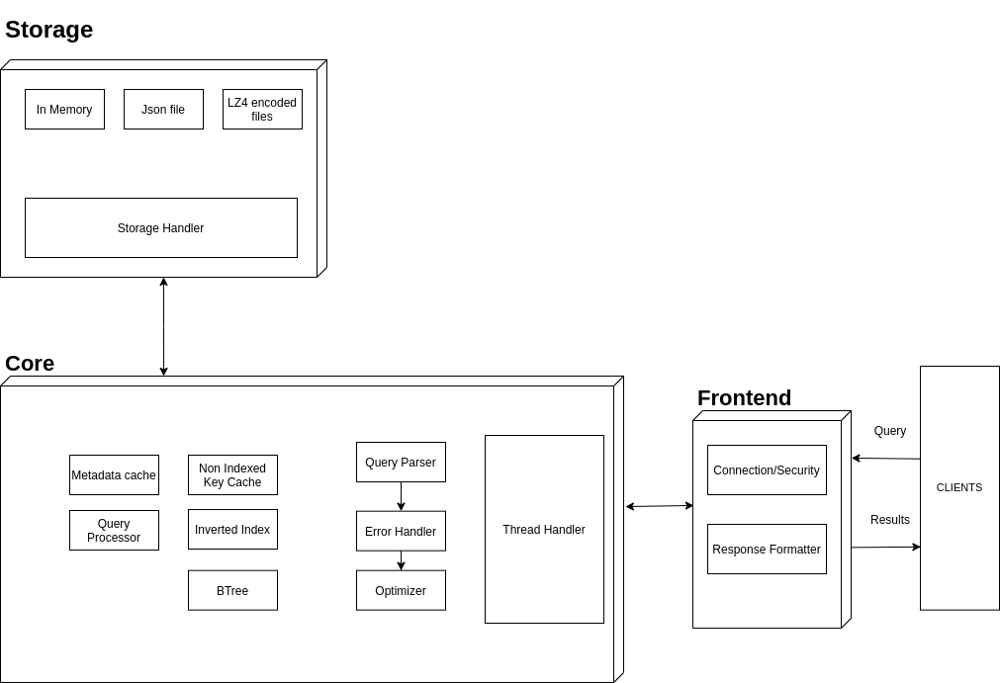

# Architecture of FlashDB

## Status

Accepted

## Context

This ADR will define the architecture of FlashDB. It will not enter into depth in each component but it's a good overview of how FlashDB works.

## Decision

A schema is better than thousand of words: 

### The Frontend component

It handles the connection from a client and check the authentication (username and password).

### The Core component

This is the brain of FlashDB. It is responsible of all logical functionalities of FlashDB.

The Core component is responsible of :
- Thread Handling. When a client is connected, he gets its own thread. This thread is provided by the Core
- Tokenize, parse and optimize a query
- Choose the right Data Structure depending the query
- Create and update the data structures used to speed up the processing of a query
- Analyze the data coming from the storage and merge it

We have 3 differents Data Structures:
- An Inverted Index for Text Field
- A B tree for indexed field
- A HasMap for non indexed field

If you want more informations about it, go to the `Core ADR`. 

### The Storage component

The Store component is the one customisable by the developer. By default, FlashDB provides 3 Storage:
- In Memory
- Json files
- Lz4 encrypted files

The Storage handler handles the sharding and the way to hash the data. It doesn't care about the storage format.

If you want more informations about it, go to the `Storage ADR`. 

## Consequences

Better understanding of FlashDB and a quick overview

